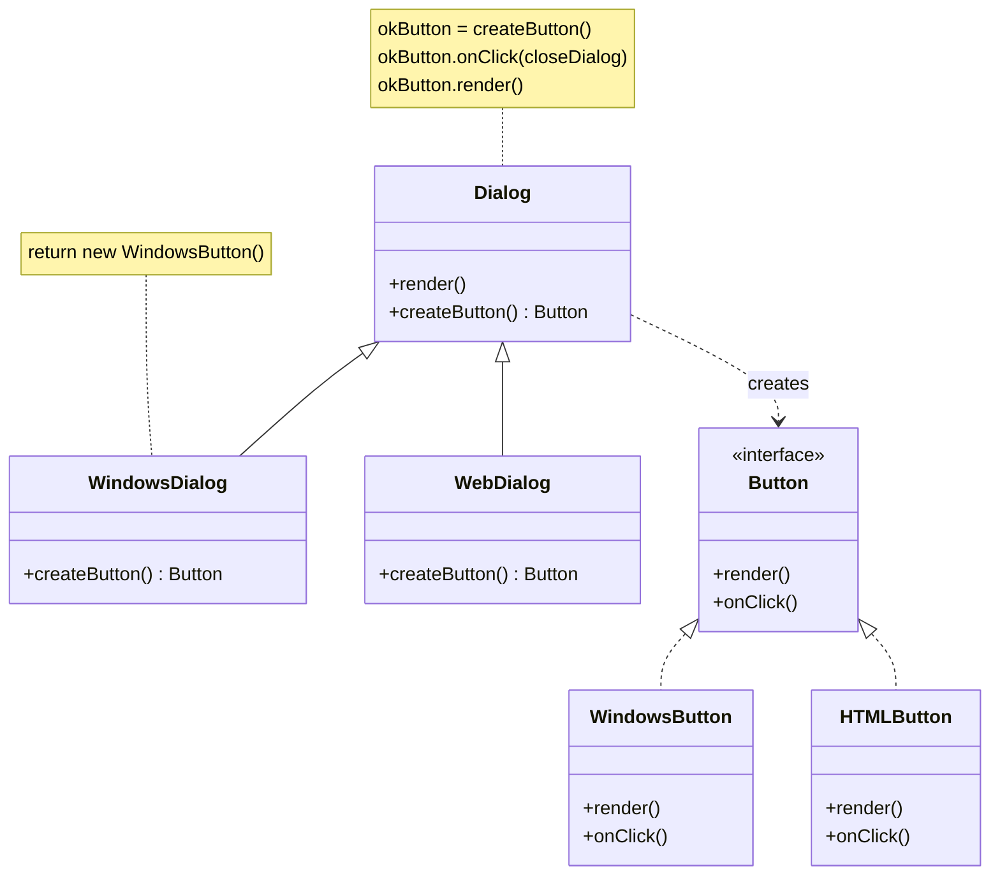
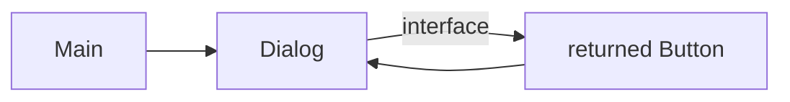

# Factory UML

## Summary

The Factory Method pattern lets a class delegate object creation to its subclasses,
so the same business logic can work with different types of objects
depending on which subclass is used.

## This code

The Factory Method pattern lets subclasses decide which type of object to create.
For example, WindowsDialog creates Windows buttons while WebDialog creates HTML buttons,
but both use the same dialog logic.

### Main.java

Main.java acts as the client that decides which concrete factory to use based on the operating system:

If Windows 10 → creates WindowsDialog
Otherwise → creates HtmlDialog

### Dialog.java

Dialog is the abstract factory class that defines the factory method createButton() but delegates the actual button creation to its subclasses.
WindowsDialog and HtmlDialog are concrete factories that implement createButton() to return their respective button types:

### Button.java

WindowsDialog.createButton() → returns WindowsButton
HtmlDialog.createButton() → returns HtmlButton

When dialog.renderWindow() is called, it uses the factory method to create the appropriate button type and then calls render() on it.

